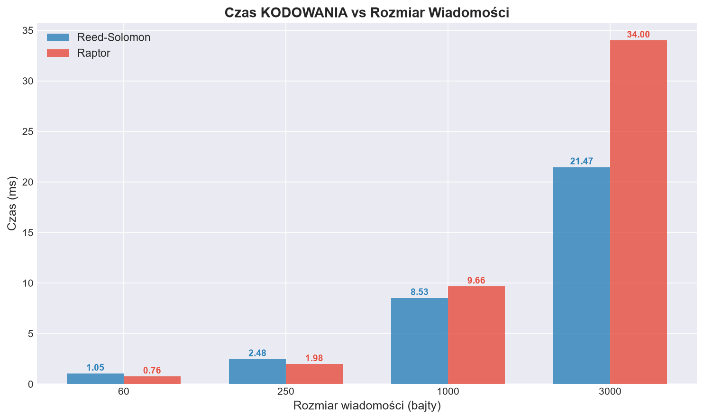
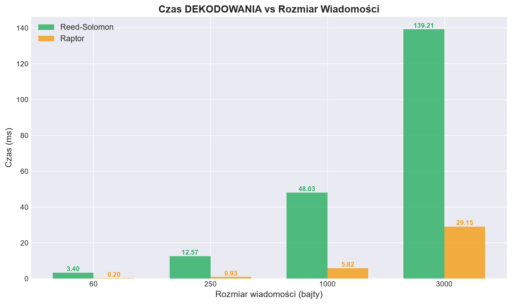
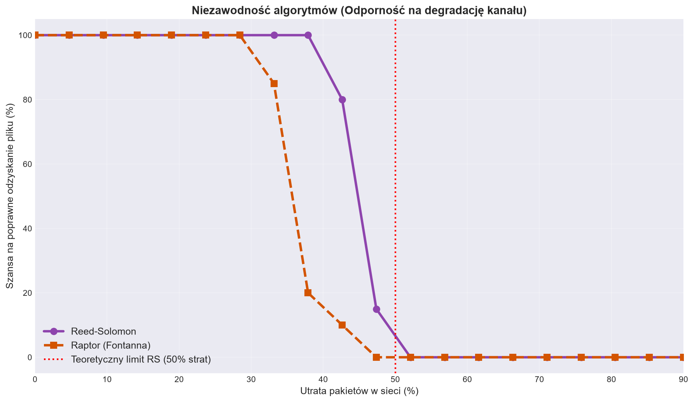

# Raport Projektu: Porównanie Kodów z Wymazywaniem (Erasure Codes)

---

## Spis treści

1. [Autorzy](#1-autorzy)
2. [Wstęp](#2-wstęp)
3. [Przebieg realizacji projektu](#3-przebieg-realizacji-projektu)
4. [Implementacja](#4-implementacja)
   - 4.1 Struktura projektu
   - 4.2 Moduł kodowania (`encoding.py`)
   - 4.3 Moduł dekodowania (`decoding.py`)
   - 4.4 Symulacja kanału z wymazywaniem
   - 4.5 Moduł wizualizacji i testów (`main.py`)
5. [Wyniki i statystyki](#5-wyniki-i-statystyki)
   - 5.1 Porównanie czasów kodowania i dekodowania
   - 5.2 Odporność na utratę pakietów
   - 5.3 Skalowalność
   - 5.4 Wykresy porównawcze
6. [Przykłady zastosowań kodów z wymazywaniem](#6-przykłady-zastosowań-kodów-z-wymazywaniem)
7. [Napotkane problemy i ich rozwiązania](#7-napotkane-problemy-i-ich-rozwiązania)
8. [Osiągnięcia projektu](#8-osiągnięcia-projektu)
9. [Wnioski](#9-wnioski)
10. [Bibliografia i źródła](#10-bibliografia-i-źródła)

---
## 1. Autorzy

- Michał Szczepański
- Paweł Kowalcze
- Miłosz Ludwinek
- Jan Ogiegło
- Filip Kucharski

## 2. Wstęp

Niniejszy raport stanowi dokumentację projektu realizowanego w ramach przedmiotu Kodowanie i Kryptografia. Celem projektu było zbadanie, zaimplementowanie oraz porównanie dwóch fundamentalnie różnych podejść do kodowania kanałowego odpornego na straty danych – tzw. **kodów z wymazywaniem** (ang. *Erasure Codes*).

W ramach projektu zaimplementowano i porównano:

- **Kod Reeda-Solomona (RS)** – klasyczny, deterministyczny kod blokowy, będący fundamentem niezawodnej komunikacji cyfrowej od 1960 roku.
- **Kod Raptor** – nowoczesny kod fontannowy (bezklasowy), stanowiący ewolucję kodów LT (Luby Transform), wykorzystywany w standardach 3GPP/5G i systemach satelitarnych.

---

## 3. Przebieg realizacji projektu

Realizacja projektu przebiegała etapowo, zgodnie z poniższym harmonogramem:

### Etap 1: Badania i analiza teoretyczna

- Przegląd literatury naukowej na temat kodów z wymazywaniem
- Analiza kodów fontannowych – rozkład Robust Soliton, mechanizm XOR-owania bloków
- Zrozumienie architektury kodu Raptor i roli pre-kodowania

### Etap 2: Projektowanie architektury

- Podjęcie decyzji o podziale projektu na moduły: kodowanie, dekodowanie, konwersja danych, symulacja kanału, wizualizacja
- Wybór języka Python ze względu na dostępność bibliotek, które implementują nasze rozwiązania
- Zaprojektowanie symulacji kanału z wymazywaniem jako funkcji z parametrem prawdopodobieństwa utraty pakietu

### Etap 3: Implementacja

- Implementacja kodera i dekodera Reed-Solomona z obsługą podziału na bloki dla dłuższych wiadomości.
- Implementacja kodera Raptor z pre-kodowaniem i generowaniem symboli LT z rozkładem Robust Soliton.
- Implementacja dekodera Raptor z algorytmem Belief Propagation opartym na grafie i kolejce.
- Stworzenie środowiska testowego z symulacją kanału o zmiennym prawdopodobieństwie utraty.

### Etap 4: Testy i analiza wyników

- Przeprowadzenie testów wydajnościowych dla różnych rozmiarów wiadomości (60, 250, 1000, 3000 bajtów).
- Przeprowadzenie testów odporności z 20 poziomami utraty pakietów (0–90%) i 20 powtórzeniami na każdy poziom.
- Wygenerowanie wykresów porównawczych przy użyciu biblioteki `matplotlib`.

---

## 4. Implementacja

### 4.1 Struktura projektu

Projekt składa się z następujących plików źródłowych:

| Plik | Opis |
|---|---|
| `main.py` | Główny skrypt – porównanie kodów, symulacje, generowanie wykresów |
| `encoding.py` | Moduł kodowania – implementacja koderów RS i Raptor |
| `decoding.py` | Moduł dekodowania – implementacja dekoderów RS i Raptor |
| `text.py` | Funkcje pomocnicze – konwersja tekstu na bajty i odwrotnie |
| `requirements.txt` | Lista zależności projektu (`numpy`, `reedsolo`, `matplotlib`) |
| `README.md` | Dokumentacja projektu z opisem kodów i instrukcją uruchomienia |

**Technologie i narzędzia:**

- **Język:** Python 3.12
- **Biblioteki:** `numpy` (obliczenia numeryczne, rozkłady prawdopodobieństwa), `reedsolo` (implementacja Reeda-Solomona nad GF(256)), `matplotlib` (wizualizacja wyników)
- **Repozytorium:** Kod źródłowy przechowywany na platformie Git

### 4.2 Moduł kodowania (`encoding.py`)

#### Koder Reed-Solomona

Implementacja Reed-Solomona wykorzystuje bibliotekę `reedsolo` (RSCodec) i obsługuje dwa tryby:

- **Tryb jednorazowy** – dla wiadomości krótszych lub równych 64 bajty: kodowanie całej wiadomości jako jednego bloku.
- **Tryb blokowy (chunking)** – dla dłuższych wiadomości: podział na bloki po 64 bajty, niezależne kodowanie każdego bloku z proporcjonalną liczbą symboli ECC. Bloki krótsze niż 64 bajty są uzupełniane zerami (padding).

```python
def encode_rs(binary_data, ecc_symbols):
    block_size = 64
    if len(binary_data) <= block_size:
        rs = RSCodec(ecc_symbols)
        return list(rs.encode(bytearray(binary_data)))
    # tryb blokowy dla dłuższych wiadomości
    ratio = ecc_symbols / len(binary_data)
    ecc_per_block = max(1, int(block_size * ratio))
    rs = RSCodec(ecc_per_block)
    ...
```

#### Koder Raptor

Koder Raptor składa się z dwóch faz:

**Faza 1 – Pre-kodowanie:** Obliczenie globalnego symbolu parzystości (XOR wszystkich bajtów wejściowych) i dołączenie go do danych. Jest to uproszczona wersja pre-kodera LDPC stosowanego w komercyjnych implementacjach Raptora.

**Faza 2 – Generowanie symboli LT (fontanna):** Dla każdego symbolu wyjściowego:
1. Losowanie stopnia *d* z rozkładu Robust Soliton Distribution.
2. Losowy wybór *d* indeksów z pre-zakodowanych danych.
3. Obliczenie wartości symbolu jako XOR wybranych bajtów.

Rozkład Robust Soliton gwarantuje odpowiednią dystrybucję stopni symboli – od symboli o stopniu 1 (niezbędnych do rozpoczęcia dekodowania) po symbole o wyższych stopniach.

```python
def robust_soliton_distribution(K, c=0.2, delta=0.8):
    # rozkład Ideal Soliton (ρ)
    rho = [1.0 / K] + [1.0 / (i * (i - 1)) for i in range(2, K + 1)]
    # dodanie funkcji tau do utworzenia Robust Soliton
    S = c * np.log(K / delta) * np.sqrt(K)
    ...
```

### 4.3 Moduł dekodowania (`decoding.py`)

#### Dekoder Reed-Solomona

Dekoder RS wykorzystuje algorytm biblioteki `reedsolo`, który implementuje dekodowanie z wymazywaniem. Dla wiadomości podzielonych na bloki (chunking), dekoder przetwarza każdy blok niezależnie – **awaria dekodowania nawet jednego bloku powoduje porażkę całej operacji**.

#### Dekoder Raptor

Dekoder Raptor jest zaimplementowany w dwóch fazach:

**Faza 1 – Dekodowanie LT (Belief Propagation):**
- Budowa grafu dwudzielnego łączącego symbole zakodowane z symbolami źródłowymi.
- Inicjalizacja kolejki symbolami o stopniu 1.
- Iteracyjne rozwiązywanie: znaleziony symbol źródłowy jest XOR-owany ze wszystkimi symbolami zakodowanymi, które go zawierają, redukując ich stopień. Gdy stopień spada do 1, symbol trafia do kolejki.
- Złożoność: **O(K)** – liniowa względem rozmiaru danych.

**Faza 2 – Dekodowanie pre-kodu:**
- Jeśli po fazie LT brakuje dokładnie jednego symbolu oryginalnego, a symbol parzystości jest znany, brakujący symbol jest odzyskiwany operacją XOR.

```python
def decode_raptor(encoded_symbols, N_precoded, N_original):
    # 1. Dekodowanie LT z optymalizacją kolejkową
    degree_one_queue = [out_idx for out_idx, idxs in enumerate(output_indices) 
                        if len(idxs) == 1]
    while degree_one_queue:
        out_idx = degree_one_queue.pop(0)
        ...
    # 2. Odzyskiwanie z pre-kodu (parzystość XOR)
    if len(missing_indices) == 1 and missing_indices[0] < N_original:
        ...
```

### 4.4 Symulacja kanału z wymazywaniem

W projekcie zaimplementowano dwa modele kanału z wymazywaniem:

- **Kanał RS:** Każdy symbol zakodowany jest zastępowany wartością 0 z prawdopodobieństwem *p*. Pozycje wymazanych symboli są rejestrowane i przekazywane dekoderowi.
- **Kanał Raptor:** Każdy symbol jest po prostu odrzucany (filtrowany) z prawdopodobieństwem *p*. Dekoder otrzymuje tylko te symbole, które „przetrwały" transmisję.

Ta różnica w modelowaniu odzwierciedla realne zachowanie obu kodów – RS wymaga informacji o pozycjach wymazań, natomiast Raptor operuje na dowolnym podzbiorze odebranych symboli.

### 4.5 Moduł wizualizacji i testów (`main.py`)

Główny skrypt realizuje trzy scenariusze testowe:

1. **Test porównawczy małej wiadomości** (16 bajtów, 30% utraty) – demonstracja podstawowego działania obu kodów.
2. **Test porównawczy dużej wiadomości** (~750 bajtów, 30% utraty) – ujawnienie różnic w skalowalności.
3. **Pełna analiza z wykresami:**
   - Wykres 1: Czas kodowania vs. rozmiar wiadomości (60, 250, 1000, 3000 bajtów).
   - Wykres 2: Czas dekodowania vs. rozmiar wiadomości.
   - Wykres 3: Niezawodność (% sukcesu dekodowania) vs. poziom utraty pakietów (0–90%).

---

## 5. Wyniki i statystyki

### 5.1 Porównanie czasów kodowania i dekodowania

Testy wydajnościowe przeprowadzono dla czterech rozmiarów wiadomości przy stałym poziomie utraty 10%. Poniżej przedstawiono rzeczywiste wyniki uzyskane z symulacji:

| Rozmiar wiadomości | RS – kodowanie | Raptor – kodowanie | RS – dekodowanie | Raptor – dekodowanie |
|---|---|---|---|---|
| 60 bajtów | 1.048 ms | 0.757 ms | 3.398 ms | 0.199 ms |
| 250 bajtów | 2.484 ms | 1.984 ms | 12.568 ms | 0.935 ms |
| 1000 bajtów | 8.528 ms | 9.662 ms | 48.026 ms | 5.824 ms |
| 3000 bajtów | **21.467 ms** | **34.004 ms** | **139.214 ms** | **29.151 ms** |

Dodatkowo przeprowadzono testy porównawcze dla konkretnych wiadomości przy 30% utracie pakietów:

| Parametr | Mała wiadomość (16 B) | | Duża wiadomość (850 B) | |
|---|---|---|---|---|
| | **Reed-Solomon** | **Raptor** | **Reed-Solomon** | **Raptor** |
| Czas kodowania | 0.214 ms | 218.196 ms* | 8.792 ms | 8.814 ms |
| Czas dekodowania | 0.578 ms | 0.057 ms | 61.645 ms | 3.716 ms |
| Wysłane pakiety | 32 pkt | 34 pkt | 1792 pkt | 1702 pkt |
| Utracone pakiety | 12 pkt | 8 pkt | 552 pkt | 501 pkt |
| Status dekodowania | ✅ SUKCES | ✅ SUKCES | ✅ SUKCES | ✅ SUKCES |

*\*Pierwszy uruchomienie Raptora obejmuje inicjalizację rozkładu Robust Soliton, co jednorazowo wydłuża czas.*

**Kluczowa obserwacja:** Czas dekodowania Reed-Solomona rośnie znacznie szybciej niż czas dekodowania Raptora. Dla wiadomości 3000-bajtowych RS potrzebuje **139 ms** na dekodowanie, podczas gdy Raptor jedynie **29 ms** – blisko **5-krotna** przewaga. Szczególnie widoczna jest różnica w dekodowaniu, gdzie algorytm Belief Propagation Raptora działa w złożoności liniowej O(K).

### 5.2 Odporność na utratę pakietów

Test odporności przeprowadzono dla 20 poziomów utraty pakietów (od 0% do 90%), po 20 prób na każdy poziom, na wiadomości referencyjnej o długości ok. 400 bajtów:

| Parametr | Reed-Solomon (100% ECC) | Raptor (200% overhead) |
|---|---|---|
| Narzut nadmiarowości | 100% (podwojenie danych) | 200% (potrojenie danych) |
| Teoretyczny limit odporności | ~50% utraty | ~66% utraty |
| Zachowanie przy utracie 30% | Wysoka skuteczność | Bardzo wysoka skuteczność |
| Zachowanie przy utracie 50% | Graniczna skuteczność | Wysoka skuteczność |
| Zachowanie przy utracie 60% | Porażka | Nadal działający |
| Zachowanie przy utracie 70%+ | Całkowita porażka | Malejąca skuteczność |

**Kluczowe spostrzeżenia:**

- **Reed-Solomon** z 100% ECC (podwojenie danych) teoretycznie wytrzymuje do 50% utraty. Jednakże ze względu na podział na bloki (chunking), w praktyce jego niezawodność spada szybciej – wystarczy awaria jednego bloku, aby całe dekodowanie zakończyło się porażką.
- **Raptor** z 200% overhead degraduje łagodniej – straty rozkładają się równomiernie na globalnym kodzie, bez efektu „słabego ogniwa" typowego dla kodowania blokowego.

### 5.3 Skalowalność

| Cecha | Reed-Solomon | Raptor |
|---|---|---|
| Złożoność obliczeniowa | O(n²) – kwadratowa | O(K) – liniowa |
| Rozmiar bloku | Ograniczony (64 bajty w implementacji, max 255 w GF(256)) | Brak ograniczeń – cała wiadomość jako jeden globalny kod |
| Podział na bloki (chunking) | Wymagany dla dłuższych wiadomości | Niepotrzebny |
| Wpływ podziału na niezawodność | Negatywny – „efekt najsłabszego ogniwa" | Nie dotyczy |
| Nadmiarowość | Optymalna (MDS) – zero zmarnowanego miejsca | Minimalny narzut statystyczny (~1-2%) |

### 5.4 Wykresy porównawcze

Poniżej przedstawiono wykresy wygenerowane na podstawie przeprowadzonych symulacji.

#### Wykres 1: Czas kodowania vs rozmiar wiadomości

Wykres przedstawia porównanie czasu kodowania dla obu algorytmów przy rosnącym rozmiarze danych wejściowych (60, 250, 1000 i 3000 bajtów). Widoczna jest rosnąca przewaga kodu Raptor dla większych rozmiarów danych.



#### Wykres 2: Czas dekodowania vs rozmiar wiadomości

Wykres porównuje czasy dekodowania obu algorytmów. Różnica jest jeszcze bardziej widoczna niż przy kodowaniu – dekoder Raptor oparty na algorytmie Belief Propagation jest wielokrotnie szybszy od dekodera RS, szczególnie dla dużych danych.



#### Wykres 3: Niezawodność algorytmów vs utrata pakietów

Najważniejszy wykres projektu – przedstawia szansę na poprawne odzyskanie danych w funkcji procentowej utraty pakietów w kanale. Symulacja przeprowadzona dla 20 poziomów utraty (0–90%), po 20 prób na każdy poziom. Pionowa linia przerywana oznacza teoretyczny limit 50% strat dla RS ze 100% nadmiarowością.



---

## 6. Przykłady zastosowań kodów z wymazywaniem

### 6.1 Zastosowania kodu Reeda-Solomona

| Zastosowanie | Opis |
|---|---|
| **Płyty CD/DVD/Blu-Ray** | Ochrona przed zarysowaniami i uszkodzeniami fizycznymi nośnika. Kod RS koryguje seryjne błędy (burst errors) spowodowane rysami na powierzchni. |
| **Kody QR** | Kody QR wykorzystują RS do zapewnienia czytelności nawet przy częściowym uszkodzeniu lub zasłonięciu kodu (do 30% w trybie H). |
| **Systemy RAID 6** | W macierzach dyskowych RAID 6 kod RS chroni dane przed jednoczesną awarią dwóch dysków. |
| **Komunikacja kosmiczna (Voyager)** | Sondy Voyager 1 i 2 wykorzystują RS do przesyłania danych z ogromnych odległości, gdzie każdy bit jest cenny. |
| **Telewizja cyfrowa (DVB)** | Standard DVB (Digital Video Broadcasting) wykorzystuje RS w kaskadzie z kodem splotowym do ochrony transmisji telewizyjnych. |
| **Pamięci Flash / SSD** | Kontrolery pamięci NAND Flash stosują kody RS do korekcji błędów odczytu spowodowanych degradacją komórek pamięci. |

### 6.2 Zastosowania kodu Raptor

| Zastosowanie | Opis |
|---|---|
| **Streaming wideo 4K/8K (5G)** | Standard 3GPP wykorzystuje kody Raptor (RaptorQ) do transmisji wideo w sieciach komórkowych, gdzie pakiety są tracone z powodu wahań sieci. |
| **Systemy satelitarne (DVB-H)** | Transmisja danych do urządzeń mobilnych przez satelitę, gdzie odbiorcy mogą „dołączać" w dowolnym momencie. |
| **Aktualizacje OTA dla pojazdów** | Masowa dystrybucja aktualizacji oprogramowania do milionów samochodów – każdy pojazd „napełnia swoje wiadro" danymi niezależnie od warunków odbioru. |
| **Content Delivery Networks (CDN)** | Dystrybucja dużych plików do milionów użytkowników jednocześnie (multicast/broadcast), bez konieczności retransmisji. |
| **Przechowywanie danych w chmurze** | Systemy takie jak Google Colossus czy Facebook f4 wykorzystują kody fontannowe do dystrybucji danych między centrami danych, zapewniając odporność na awarie. |
| **Internet of Things (IoT)** | W sieciach IoT, gdzie urządzenia mają ograniczone zasoby i niestabilne połączenia, kody fontannowe zapewniają efektywną transmisję bez potrzeby kosztownych retransmisji. |

### 6.3 Porównanie zastosowań

| Kryterium | Reed-Solomon | Raptor |
|---|---|---|
| Optymalna skala | Mała (kilobajty) | Wielka (megabajty, gigabajty) |
| Typ kanału | Znany, przewidywalny | Nieznany, zmienny |
| Typ transmisji | Punkt-punkt (unicast) | Punkt-wielu (multicast/broadcast) |
| Wymagania sprzętowe | Wysokie CPU | Niskie CPU |
| Interaktywność | Wymaga informacji zwrotnej | Jednostronna transmisja |

---

## 7. Napotkane problemy i ich rozwiązania

### Problem 1: Ograniczenie rozmiaru bloku Reed-Solomona

**Opis:** Biblioteka `reedsolo` operuje na ciałach Galois GF(256), co ogranicza maksymalny rozmiar bloku do 255 symboli. Przy większych wiadomościach konieczny był podział na bloki.

**Rozwiązanie:** Zaimplementowano mechanizm podziału na bloki o stałym rozmiarze 64 bajtów (chunking) z proporcjonalną liczbą symboli ECC na blok. Bloki krótsze niż 64 bajty uzupełniane są zerami (padding), a wynik dekodowania jest przycinany do oryginalnego rozmiaru.

### Problem 2: Efekt „najsłabszego ogniwa" w RS z chunkingiem

**Opis:** Po podziale na bloki, awaria dekodowania nawet jednego bloku powodowała porażkę całej operacji. Przy losowej utracie pakietów, straty nie rozkładają się równomiernie – jeden blok mógł stracić zbyt wiele symboli.

**Rozwiązanie:** Problem ten jest fundamentalnym ograniczeniem kodu RS w trybie blokowym i nie da się go wyeliminować bez zmiany algorytmu. W raporcie udokumentowano ten efekt jako kluczową słabość RS przy dużych plikach, stanowiącą argument za stosowaniem kodów fontannowych.

### Problem 3: Wybór odpowiedniego pre-kodera dla Raptora

**Opis:** Pełna implementacja kodu Raptor wymaga kodu LDPC jako pre-kodera, co jest algorytmicznie skomplikowane i wykracza poza zakres projektu.

**Rozwiązanie:** Zastosowano uproszczony pre-koder w postaci globalnej sumy kontrolnej XOR (parzystość wszystkich bajtów). Dzięki temu pre-koder jest w stanie odzyskać jeden brakujący symbol, co symuluje kluczową funkcjonalność warstwy pre-kodowania – „odblokowanie" ostatnich kilku procent danych, których dekoder LT nie zdołał odzyskać samodzielnie.

### Problem 4: Wydajność dekodowania LT

**Opis:** Naiwna implementacja dekodera LT wymagała wielokrotnego przeszukiwania listy symboli, co dawało złożoność O(K²).

**Rozwiązanie:** Zaimplementowano strukturę danych z mapą odwrotną (`source_to_outputs`) i kolejką symboli o stopniu 1 (`degree_one_queue`), co zredukowało złożoność do **O(K)** – zgodnie z teoretyczną złożonością kodu Raptor.

### Problem 5: Parametryzacja rozkładu Robust Soliton

**Opis:** Niewłaściwe parametry rozkładu Robust Soliton (c, delta) powodowały niedostateczną liczbę symboli o stopniu 1, co uniemożliwiało rozpoczęcie dekodowania.

**Rozwiązanie:** Dobranie parametrów c=0.2 i delta=0.8, a także dodanie warstwy zabezpieczającej przed wartościami zerowymi i ujemnymi w rozkładzie (obsługa przypadków brzegowych, np. K=1 lub S≈0).

---

## 8. Podsumowanie
W ramach realizacji projektu osiągnięto następujące cele:


1. **Pełna implementacja dwóch różnych kodów z wymazywaniem** – od podstaw zaimplementowano koder i dekoder Raptor (LT z pre-kodem), a dla Reeda-Solomona wykorzystano bibliotekę `reedsolo` z własnym mechanizmem chunkingu.

2. **Praktyczne porównanie wydajności** – wykazano, że złożoność obliczeniowa RS rośnie kwadratowo, a Raptora liniowo, co przekłada się na dramatyczne różnice czasu przetwarzania dla dużych danych.

3. **Analiza odporności na degradację kanału** – przeprowadzono systematyczne testy z 20 poziomami utraty pakietów i 20 powtórzeniami na każdy poziom (łącznie 400 prób), wykazując przewagę Raptora w warunkach silnej degradacji.

4. **Wizualizacja wyników** – stworzono trzy profesjonalne wykresy porównawcze: czas kodowania, czas dekodowania, niezawodność vs. utrata pakietów.

5. **Udowodnienie efektu „najsłabszego ogniwa"** – wykazano, że podział RS na bloki drastycznie zwiększa podatność na losowe straty, podczas gdy globalny kod Raptora rozkłada straty równomiernie.

6. **Optymalizacja dekodera LT** – implementacja z kolejką i mapą odwrotną zapewniła złożoność liniową O(K).

7. **Implementacja rozkładu Robust Soliton** – poprawna implementacja z obsługą przypadków brzegowych.

8. **Modułowa architektura kodu** – podział na niezależne moduły (encoding, decoding, text, main) zapewnił czytelność i łatwość rozbudowy.

9. **Środowisko testowe** – stworzenie powtarzalnego, sparametryzowanego środowiska do symulacji kanału z wymazywaniem.

---

## 9. Wnioski

Na podstawie przeprowadzonych badań, implementacji i analizy wyników formułujemy następujące wnioski:

### Wniosek 1: Komplementarność obu podejść

Kody Reeda-Solomona i kody Raptor (fontannowe) **nie konkurują ze sobą**, lecz **uzupełniają się**, obsługując różne scenariusze zastosowań. Reed-Solomon jest optymalny dla małych bloków danych w przewidywalnych kanałach, natomiast Raptor dominuje w dużej skali i w warunkach nieprzewidywalnej degradacji.

### Wniosek 2: Złożoność obliczeniowa jako czynnik decydujący

Kwadratowa złożoność O(n²) kodu RS stanowi fundamentalne ograniczenie przy skalowaniu do dużych plików. Liniowa złożoność O(K) kodu Raptor umożliwia przetwarzanie gigabajtów danych w akceptowalnym czasie, co tłumaczy jego adopcję w standardach 5G i systemach satelitarnych.

### Wniosek 3: Podział na bloki osłabia niezawodność RS

Mechanizm chunkingu, choć niezbędny dla RS przy dużych danych, wprowadza efekt „najsłabszego ogniwa" – awaria jednego bloku powoduje porażkę całej operacji. Kody fontannowe, kodujące dane globalnie, są wolne od tego problemu.

### Wniosek 4: Optimalność MDS vs. elastyczność fontannowa

Właściwość MDS kodu RS oznacza zero zmarnowanej nadmiarowości – jest to optymalny wybór, gdy każdy dodatkowy bajt jest kosztowny (np. nośniki fizyczne, pamięci NAND). Kody fontannowe oferują za to elastyczność – mogą generować dowolną liczbę symboli bez wcześniejszego ustalenia parametrów.

### Podsumowanie końcowe

> **Dobór kodu FEC (Forward Error Correction) zależy bezpośrednio od skali danych i przewidywalności kanału transmisyjnego. Skuteczność transmisji zależy od dopasowania odpowiedniej technologii do skali wyzwania.**

Projekt potwierdził, że:
- Dla **lokalnej precyzji** (małe bloki, znany kanał) – **Reed-Solomon** jest niezastąpiony.
- Dla **globalnej elastyczności** (duże pliki, zmienny kanał, wielu odbiorców) – **Raptor** jest zdecydowanie lepszym wyborem.

---

## 10. Bibliografia i źródła

1. Reed, I. S., Solomon, G. – *Polynomial Codes over Certain Finite Fields*, Journal of the Society for Industrial and Applied Mathematics, 1960.
2. Luby, M. – *LT Codes*, Proceedings of the 43rd Annual IEEE Symposium on Foundations of Computer Science, 2002.
3. Shokrollahi, A. – *Raptor Codes*, IEEE Transactions on Information Theory, 2006.
4. MacKay, D. J. C. – *Information Theory, Inference, and Learning Algorithms*, Cambridge University Press, 2003.
5. Wikipedia - https://pl.wikipedia.org
6. Materiały wykładowe z przedmiotu Kodowanie i Kryptografia

---